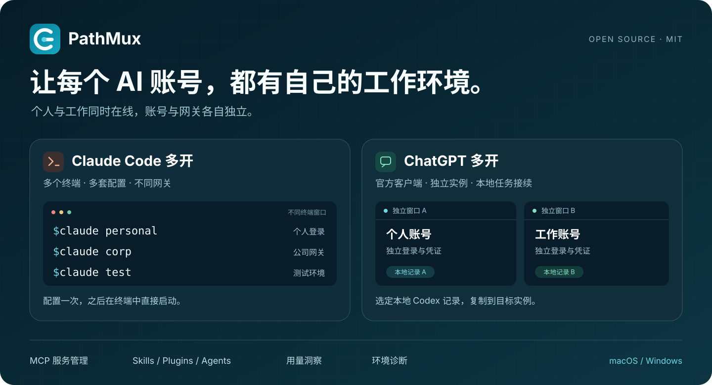
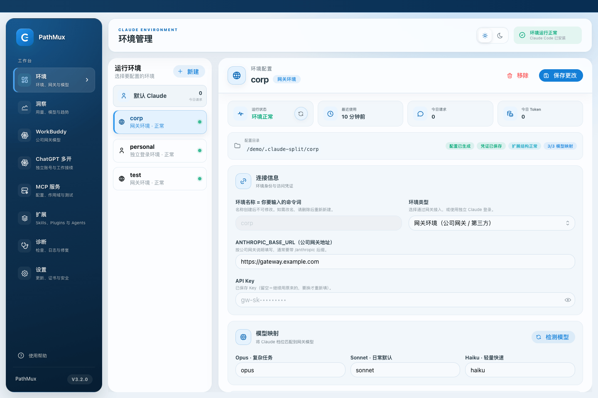
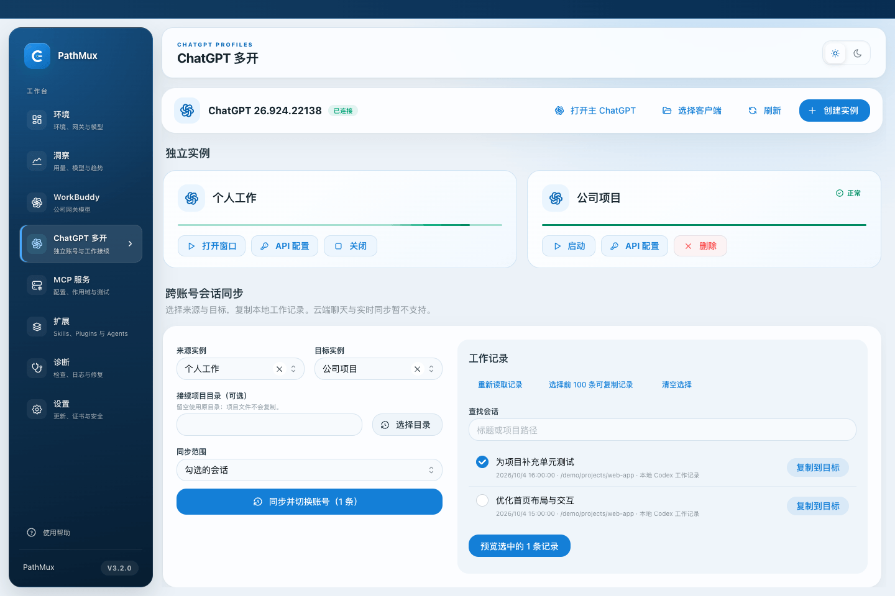

<div align="center">


# PathMux

### Claude Code 多开 · ChatGPT 多开

**一台电脑，多套 AI 工作环境。让个人与工作、不同账号与网关，同时在线。**

[](https://github.com/Hollelihanqi/new-claude/releases/latest) [](LICENSE) 

[下载安装](https://github.com/Hollelihanqi/new-claude/releases) · [Claude Code 多开](#claude-code-多开) · [ChatGPT 多开](#chatgpt-多开) · [快速上手](#快速上手) · [反馈建议](https://github.com/Hollelihanqi/new-claude/issues)



</div>

PathMux 是一款开源桌面管理工具，围绕 **Claude Code 多环境并行**和 **ChatGPT 官方客户端多实例运行**，把账号、网关、模型与常用配置集中管理。日常仍使用熟悉的终端与官方客户端，PathMux 负责准备和管理各自的工作环境。

> 支持 macOS 与 Windows 桌面端。ChatGPT 多开需要具备独立数据目录能力的官方客户端；macOS 已有双账号多开实测记录，Windows 真机登录与窗口流程仍待验证，详见[验证记录](docs/testing/ChatGPT多开-Windows测试交接-2026-09-28.md)。

## 为什么用 PathMux？

| 你想做的事 | PathMux 如何帮你 |
| --- | --- |
| 同时使用个人 Claude 与公司网关 | 创建独立环境，在不同终端分别运行 `claude personal`、`claude corp` |
| 为不同项目保留不同模型配置 | 每个网关环境单独设置地址、Key 和 Opus / Sonnet / Haiku 模型映射 |
| 同时打开多个 ChatGPT 账号 | 创建独立实例，各自在官方窗口登录、启动和切换 |
| 换账号后接着做本地 Codex 任务 | 选择工作记录，预览后复制到目标实例，以独立副本接续 |
| 少做重复配置 | 集中管理 MCP、Skills、Plugins 与 Agents，按环境分发或保留独立配置 |

## Claude Code 多开

**同一项目，不同终端，各用各的账号与网关。**

为个人工作、公司项目和测试任务创建不同环境，然后在各自的终端中启动。每条命令选择自己的环境，无需反复改动一份全局配置。

```bash
# 在不同终端窗口中分别运行，环境名由你自己创建
claude             # 默认 Claude
claude personal    # 个人独立登录环境
claude corp        # 公司网关环境
claude test        # 测试网关环境
```

- **两种环境类型**：网关环境配置地址与 API Key；独立登录环境使用各自的登录状态。
- **模型按环境设置**：分别配置 Opus、Sonnet、Haiku 档位的模型映射，并检测网关提供的模型。
- **配置互不串用**：受管理环境使用独立 Claude 配置目录，PathMux 对默认 Claude 配置只读。
- **保存后终端直用**：接入终端后，在新终端中运行 `claude <环境名>`；PathMux 无需一直开着。



<p align="center"><sub>实际前端界面，使用虚构环境与演示数据；网关地址仅作示例。</sub></p>

## ChatGPT 多开

**多个账号，多个官方窗口，分别保留各自的工作状态。**

PathMux 复用本机安装的官方 ChatGPT 客户端，为每个实例准备独立的桌面数据、Codex 配置、凭证与会话数据库目录。给实例起一个容易辨认的名字，在对应的官方窗口中完成登录，再按需启动、打开窗口或关闭。

- **独立实例并行使用**：个人账号、工作账号分别登录，无需在同一个窗口中来回退出。
- **集中管理窗口**：在一处创建实例、查看状态、启动、聚焦、关闭和检查实例。
- **按实例配置 API**：可保存独立的 API 地址、Key 与模型配置，用于客户端的 Codex 工作能力；可切回账号登录。
- **本地工作记录接续**：按会话、项目或全部本地会话选择范围，复制到目标实例后打开目标会话。



<p align="center"><sub>实际前端界面，使用虚构实例与演示工作记录；截图用于展示管理流程。</sub></p>

### 换个账号，接着做本地任务

1. 选择来源实例和目标实例。
2. 勾选需要接续的本地 Codex 会话，或选择项目 / 全部本地会话。
3. 点击「同步并切换账号」，核对复制范围；目标正在运行时，按提示关闭它。
4. 创建独立副本后，在目标账号中打开会话。来源记录保留，目标后续进展独立保存。

> **会话接续范围**：目前支持本地 Codex 工作记录的按次复制，以及受支持记录中的本地图片附件。普通 ChatGPT 云端聊天、云端任务和两个运行窗口之间的实时双向同步暂不支持。复制不包含账号凭证、工具授权或项目文件；两个实例选择同一项目目录时，仍会操作同一份项目文件。

## 多开之外，把常用配置也管好

| 功能 | 用途 |
| --- | --- |
| **MCP 服务管理** | 管理作用范围、加载配置与连接检测；支持与 Codex 的配置同步 |
| **Skills / Agents 共享** | 分发可复用的工作方法；Skills 支持 Claude 环境与 Codex，Agents 面向 Claude 环境 |
| **Plugins 管理** | 通过 Claude Code 官方命令在各环境分别安装、启用、停用与更新 |
| **用量洞察** | 从本地记录查看请求、Token、模型与使用趋势 |
| **诊断与证书** | 检查环境和网关问题，为使用自签名证书的网关导入 CA |
| **界面主题** | 明暗模式与多套主题，按自己的习惯选择 |

## 快速上手

### 1. 下载 PathMux

前往 **[GitHub Releases](https://github.com/Hollelihanqi/new-claude/releases)**，选择适合系统与芯片架构的安装包。以对应版本的发布说明为准确认新增功能与已知限制。

| 系统 | 安装方式 |
| --- | --- |
| macOS | 下载 `.dmg`，打开后将 PathMux 拖入「应用程序」 |
| Windows | 下载 `.msi` 或 `.exe` 安装包，按安装向导完成安装 |

### 2. 开启 Claude Code 多开

1. 安装 [Claude Code](https://code.claude.com/docs/en/setup)，确认终端可以运行 `claude`。
2. 打开 PathMux 的「环境」页面，点击「新建」，选择网关环境或独立登录环境。
3. 设置环境名称；使用网关时填写地址、Key 与模型映射，然后点击「保存更改」。
4. 按应用提示完成终端接入，重新打开终端后运行 `claude <环境名>`。Windows 使用 PowerShell；独立登录环境按 Claude Code 提示完成登录。

### 3. 开启 ChatGPT 多开

1. 先安装并正常打开一次具备独立数据目录能力的官方 ChatGPT 客户端。
2. 进入 PathMux 的「ChatGPT 多开」页面，确认客户端已识别；未找到时点击「选择客户端」。
3. 点击「创建实例」，设置名称，启动后在该实例的官方窗口中登录。
4. 为其他账号重复创建实例，即可分别打开使用。需要接续本地任务时，再选择来源与目标复制工作记录。

更多操作说明见应用内「使用帮助」。

## 常见问题

<details>
<summary><strong>Claude Code 多开只是开多个终端吗？</strong></summary>

多个终端是使用入口。PathMux 额外为各环境管理独立配置、登录状态、网关凭据和模型映射，让不同终端能够同时使用不同环境。配置完成后，关闭 PathMux 仍可使用已接入的终端命令。

</details>

<details>
<summary><strong>ChatGPT 多开支持所有版本的客户端吗？</strong></summary>

需要具备独立数据目录能力的官方 Codex / Electron 桌面客户端。旧版原生客户端不在支持范围内，PathMux 会检查兼容性；官方客户端更新后也可能需要重新检查或适配。

</details>

<details>
<summary><strong>多开是否会共享账号、额度或项目文件？</strong></summary>

账号登录与凭证分别保存，各账号使用自己的服务权限和额度。目录隔离用于分开工作配置，不是操作系统安全沙箱。如果两个实例选择同一个项目目录，仍会读写同一份文件；需要独立修改代码时，应使用不同工作目录。

</details>

<details>
<summary><strong>可以把普通 ChatGPT 聊天同步到另一个账号吗？</strong></summary>

目前只支持本地 Codex 工作记录的选择性复制。普通 ChatGPT 云端聊天和实时双向同步暂不支持；目标副本与来源后续各自发展，已有目标进展不会因重复复制同一快照而被覆盖。

</details>

<details>
<summary><strong>公司网关使用自签名证书怎么办？</strong></summary>

准备管理员提供的网关地址、Key 与 CA 证书，在「设置」中按提示导入证书，再回到环境页面检查连接。

</details>

<details>
<summary><strong>PathMux 免费吗？</strong></summary>

PathMux 使用 MIT 开源许可。Claude、ChatGPT 订阅或网关 API 的费用由对应服务提供方收取。

</details>

## 本地开发

基于 **React + TypeScript + Tauri 2 + Rust**。准备 Node.js、pnpm、Rust 及对应平台的 Tauri 构建依赖后：

```bash
pnpm install
pnpm tauri dev
```

构建安装包：

```bash
pnpm tauri build
```

<details>
<summary>开发检查命令</summary>

```bash
pnpm build
pnpm test -- --run
cargo test --manifest-path src-tauri/Cargo.toml
cargo fmt --manifest-path src-tauri/Cargo.toml -- --check
git diff --check
```

</details>

## 参与和支持

如果 PathMux 让你的多账号工作更顺手，欢迎 **Star**，或分享给同样需要 Claude Code / ChatGPT 多开的朋友。

遇到问题或有新想法，欢迎提交 [Issue](https://github.com/Hollelihanqi/new-claude/issues)；反馈时附上操作系统、PathMux / 客户端版本与复现步骤，并移除密钥和账号等敏感信息。也欢迎提交 Pull Request。

[MIT License](LICENSE) · PathMux 是独立开源项目，与 Anthropic、OpenAI 无官方隶属关系。
